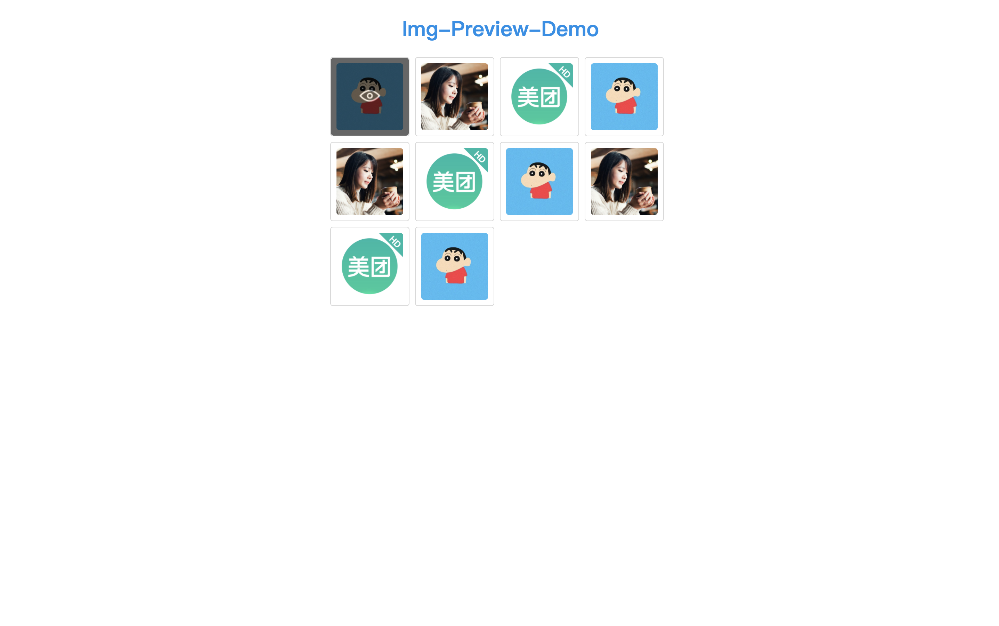
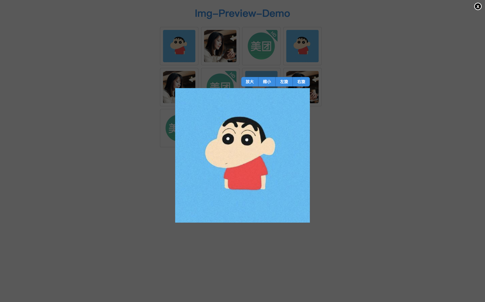

# ImgPreview
[](https://www.npmjs.com/package/img-preview)
## Introduce
Picture preview components, click to full screen display, support for zoom in, drag and other operations.
## Install
`$ npm install img-preview --save`
## Usage
```
import ImgPreview from 'img-preview';
...
class AgentList extends Component {
  ...
  render(){
    return (
      <div>
        <ImgPreview src='url'/>
        <ImgPreview src={[url0, url1, url2]}/>
        <ImgPreview
          render={(t) => <a href={t.url}>t.name</a>}
          src={[
            {
              url: '111',
              name: '111,
            }, {
              url: '222',
              name: '222,
            },{
              url: '333',
              name: '333,
            },
          ]}
        />
      </div>
  }
}
```
## Configuration
- src: support array or string (url address)
- render: custom rendering list style

Note: When using render, src must be array type, each array must be object type and have src attribute, detail to see demo.
## Features
- Automatically generate preview thumbnails
- Click on the thumbnail pop-up big picture
- Support custom list style
- Support zoom in, rotate, drag and other operations
## Overview
### Thumbnail list

### Detail
