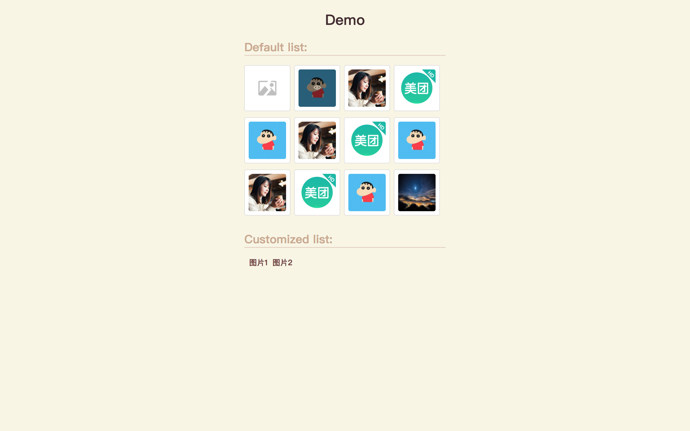
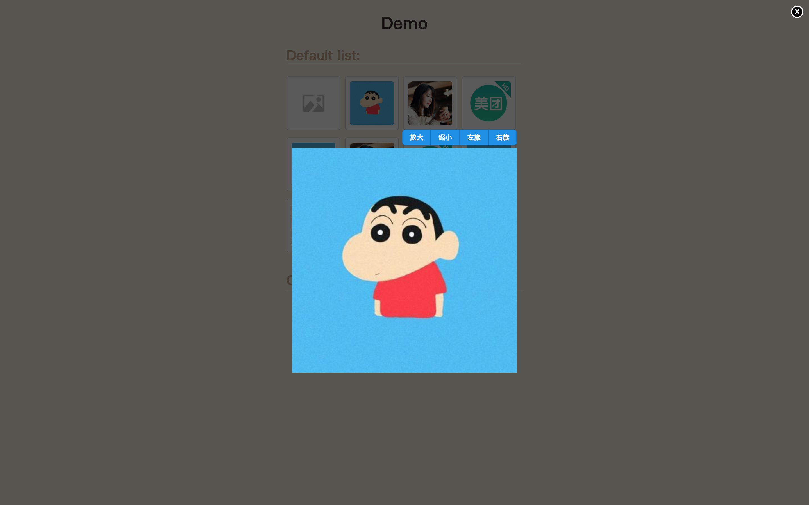

# img-preview
## 介绍
图片预览组件，点击后全屏显示，支持放大缩小、拖拽等操作。
## 安装
`$ npm install img-preview`
## 使用
```
import ImgPreview from 'img-preview';
...
class AgentList extends Component {
  ...
  render(){
    return (
      <div>
        <ImgPreview src='url'/>
        <ImgPreview src={[url0, url1, url2]}/>
      </div>
  }
}
```
## 配置
- src: 支持数组或是字符串（url地址）
## 特性
- 自动生成预览缩略图
- 点击缩略图后弹出大图
- 支持放大缩小、旋转、拖拽等操作
## 预览
| 缩略图列表 | 大图 |
| ---- | ---- |
|  |  |
